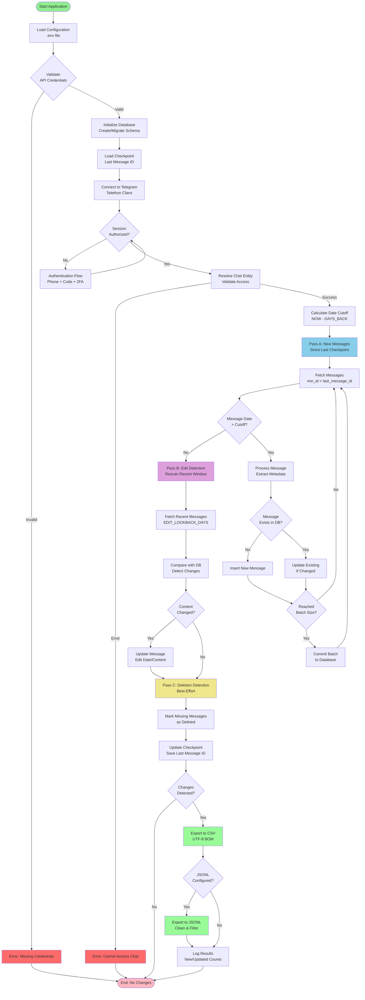
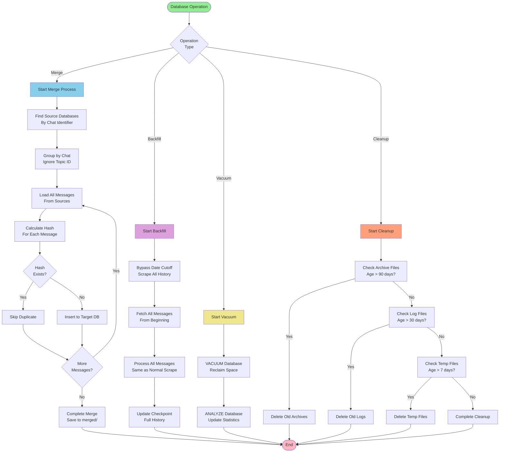
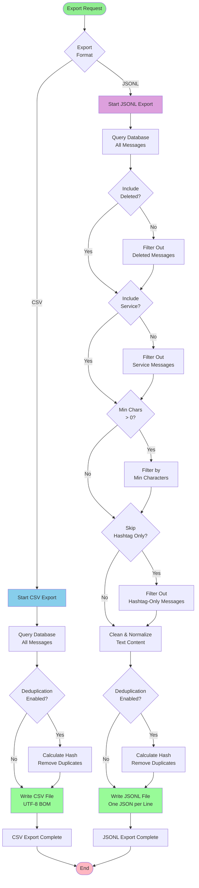

# TG Work Checker

A comprehensive Telegram message scraper and analyzer that extracts messages from Telegram chats, channels, and forum topics, stores them in SQLite databases, and provides multiple export formats for analysis.

## Features

- **Incremental Scraping**: Fast checkpoint-based updates that only fetch new messages
- **Edit & Deletion Tracking**: Detects message edits and marks deletions within a configurable window
- **Multiple Export Formats**:
  - Excel-friendly CSV (UTF-8 with BOM for Cyrillic support)
  - ChatGPT-ready JSONL (clean, normalized text)
- **Database Management**: Merge, deduplicate, and manage multiple databases
- **REST API**: Full API for programmatic access and automation
- **Health Monitoring**: Built-in health checks and system monitoring
- **Maintenance Tools**: Automated cleanup and optimization scripts
- **Comprehensive Logging**: Detailed logs with daily rotation

## Version

**Current Version: 0.3.0**

See [CHANGELOG.md](CHANGELOG.md) for detailed version history.

---

## How It Works

### Step-by-Step Process

#### 1. **Initialization & Configuration**
   - Load environment variables from `.env` file
   - Validate API credentials (`API_ID`, `API_HASH`)
   - Parse chat identifier (username, @username, or t.me link)
   - Extract topic/thread ID if present in URL
   - Initialize or migrate SQLite database schema
   - Load checkpoint (last message ID from previous run)

#### 2. **Authentication**
   - Connect to Telegram using Telethon client
   - Check if session is authorized
   - If not authorized:
     - Prompt for phone number (first run only)
     - Request and verify login code
     - Handle 2FA password if enabled
   - Store session for future runs

#### 3. **Chat Validation**
   - Resolve chat identifier to Telegram entity
   - Verify access permissions
   - Extract chat metadata (ID, title, description)
   - Handle errors (private channels, invalid usernames)

#### 4. **Message Scraping (Incremental)**
   - **Pass A: New Messages (Fast)**
     - Fetch messages since last checkpoint (`min_id`)
     - Filter by date cutoff (`DAYS_BACK`)
     - Batch process messages in memory
     - Detect new vs. existing messages
   
   - **Pass B: Edit Detection (Slower)**
     - Rescan recent window (`EDIT_LOOKBACK_DAYS`)
     - Compare message content with database
     - Detect edits, sender changes, reply updates
     - Update existing records

   - **Pass C: Deletion Detection (Best-Effort)**
     - Mark messages as deleted if missing from recent fetch
     - Only within configured window

#### 5. **Database Operations**
   - **Upsert Logic**: Insert new or update existing messages
   - **Batch Writes**: Process messages in batches for performance
   - **Conflict Resolution**: Handle duplicate message IDs
   - **Transaction Management**: Commit in batches, rollback on errors
   - **Checkpoint Update**: Save last message ID for next run

#### 6. **Export Generation**
   - **CSV Export**:
     - Query all messages from database
     - Apply deduplication if configured
     - Write with UTF-8 BOM for Excel compatibility
     - Only regenerate if changes detected
   
   - **JSONL Export** (ChatGPT-ready):
     - Filter messages (min chars, hashtag-only, deleted, service)
     - Clean and normalize text
     - Apply deduplication options
     - Write one JSON object per line

#### 7. **Cleanup & Maintenance**
   - Archive deleted files (3-month retention)
   - Clean up old logs and temp files
   - Vacuum databases to reclaim space
   - Health checks and monitoring

### Application Flowchart



### Web API Flowchart

```mermaid
flowchart TD
    Start([API Request]) --> Route{Endpoint<br/>Type}
    
    Route -->|POST /validate| Validate[Validate Chat<br/>Check Existence]
    Validate --> GetChatInfo[Get Chat Info<br/>Title, Description]
    GetChatInfo --> ProbeHistory[Probe Message History<br/>Find Earliest Date]
    ProbeHistory --> ReturnValidate[Return Validation<br/>Response]
    
    Route -->|POST /scrape| CreateJob[Create Job<br/>Generate Job ID]
    CreateJob --> QueueJob[Queue Job<br/>Status: queued]
    QueueJob --> StartAsync[Start Async Task<br/>Background Processing]
    StartAsync --> ReturnJobID[Return Job ID]
    
    StartAsync --> RunScrape[Run Scraping Process<br/>Same as CLI Flow]
    RunScrape --> UpdateProgress[Update Job Status<br/>scanned, new, updated]
    UpdateProgress --> CompleteJob[Mark Job Complete<br/>Status: done]
    
    Route -->|GET /status/{job_id}| GetStatus[Get Job Status<br/>from Memory]
    GetStatus --> ReturnStatus[Return Status<br/>JSON Response]
    
    Route -->|GET /download/{job_id}/{kind}| CheckJob{Job<br/>Complete?}
    CheckJob -->|No| ErrorNotReady[Error: Job Not Ready]
    CheckJob -->|Yes| GetFile[Get Export File<br/>CSV/JSONL/DB]
    GetFile --> StreamFile[Stream File<br/>to Client]
    
    Route -->|GET /health| SystemHealth[Check System Health<br/>Disk Space, etc.]
    SystemHealth --> ReturnHealth[Return Health<br/>Status]
    
    Route -->|GET /health/database/{db}| DBHealth[Check Database Health<br/>Integrity, Counts]
    DBHealth --> ReturnDBHealth[Return DB Health<br/>Status]
    
    Route -->|DELETE /api/delete/{db}| ArchiveDB[Archive Database<br/>Move to Archive/]
    ArchiveDB --> ArchiveRelated[Archive Related Files<br/>CSV, JSONL]
    ArchiveRelated --> ReturnDelete[Return Success]
    
    ReturnValidate --> End([End])
    ReturnJobID --> End
    ReturnStatus --> End
    StreamFile --> End
    ReturnHealth --> End
    ReturnDBHealth --> End
    ReturnDelete --> End
    ErrorNotReady --> End
    
    style Start fill:#90EE90
    style End fill:#FFB6C1
    style RunScrape fill:#87CEEB
    style UpdateProgress fill:#DDA0DD
    style CompleteJob fill:#98FB98
    style ErrorNotReady fill:#FF6B6B
```

### Database Management Flowchart



### Export Process Flowchart



> **Note:** These flowcharts are maintained and updated as new features are added. When functionality changes, the flowcharts will be updated to reflect the new process flow.

---

## Output Files

The scraper creates:

- **SQLite database**: `telegram_messages.db` (configurable via `OUTPUT_DB`)
  - Stores all messages with full metadata
  - Supports incremental updates
  - Tracks edits and deletions

- **CSV export**: `telegram_messages.csv` (configurable via `OUTPUT_CSV`)
  - Excel-friendly format with UTF-8 BOM
  - All message fields included
  - Automatically updated after each scrape

- **ChatGPT export (JSONL)**: `chatgpt_export.jsonl` (configurable via `OUTPUT_CHATGPT`)
  - Clean, normalized text
  - Optimized for AI analysis
  - Configurable filtering options

> **Important:** These output files contain scraped data and should not be committed to Git. They are automatically ignored via `.gitignore`.

---

## Requirements

- **Python 3.10+** (tested on Windows, should work on Linux/Mac)
- **Telegram API credentials** - Get from [https://my.telegram.org/apps](https://my.telegram.org/apps)
  - `API_ID` - Your application ID
  - `API_HASH` - Your application hash

### Installation

```powershell
# Create virtual environment (recommended)
python -m venv .venv
.\.venv\Scripts\Activate.ps1  # On Windows
# source .venv/bin/activate    # On Linux/Mac

# Install dependencies
pip install -r requirements.txt
```

### Dependencies

- `telethon` - Telegram client library
- `python-dotenv` - Environment variable management
- `fastapi` - Web framework for API
- `uvicorn` - ASGI server

---

## Configuration

### Environment Variables

Create a `.env` file in the project root (copy from `.env.example`):

```powershell
copy .env.example .env
# Edit .env with your credentials
```

### Required Settings

```env
API_ID=your_api_id_here
API_HASH=your_api_hash_here
```

Get these from [https://my.telegram.org/apps](https://my.telegram.org/apps)

### Optional Settings

```env
# Chat to scrape (username, @username, or t.me link)
CHAT_IDENTIFIER=https://t.me/cyprusithr/46679

# Scraping window
DAYS_BACK=365                    # Days to scrape back
EDIT_LOOKBACK_DAYS=365          # Window for edit/deletion detection

# Output files
OUTPUT_DB=telegram_messages.db
OUTPUT_CSV=telegram_messages.csv
OUTPUT_CHATGPT=chatgpt_export.jsonl

# Export filtering (for ChatGPT export)
MIN_CHARS=0                      # Minimum characters per message
SKIP_HASHTAG_ONLY=0              # Skip messages that are only hashtags
INCLUDE_DELETED=0                # Include deleted messages
INCLUDE_SERVICE=0                # Include service messages

# Web server
PORT=8000                        # Server port
LOG_LEVEL=INFO                   # Logging level (DEBUG/INFO/WARNING/ERROR)
```

See `.env.example` for all available options with descriptions.

---

## Quick Start

### 1. Installation

```powershell
# Clone the repository
git clone https://github.com/Alish3r/TG-Work-Checker.git
cd TG-Work-Checker

# Create virtual environment
python -m venv .venv
.\.venv\Scripts\Activate.ps1

# Install dependencies
pip install -r requirements.txt
```

### 2. Configuration

Copy `.env.example` to `.env` and fill in your Telegram API credentials:

```powershell
copy .env.example .env
# Edit .env with your API_ID and API_HASH from https://my.telegram.org/apps
```

### 3. First Run

```powershell
# Run the scraper (will prompt for phone/login)
python scrape_telegram.py

# Export to CSV
python export_messages.py

# Export for ChatGPT
python export_chatgpt.py
```

## Maintenance & Best Practices

### Documentation

- **[MAINTENANCE.md](MAINTENANCE.md)** - Maintenance procedures and schedules
- **[BEST_PRACTICES.md](BEST_PRACTICES.md)** - Coding standards and best practices
- **[TROUBLESHOOTING.md](TROUBLESHOOTING.md)** - Common issues and solutions
- **[MAINTENANCE_SUMMARY.md](MAINTENANCE_SUMMARY.md)** - Summary of maintenance improvements

### Quick Maintenance Commands

```powershell
# Run all maintenance tasks
python maintenance.py --all

# Individual tasks
python maintenance.py --check-dbs      # Check database health
python maintenance.py --check-system  # Check system resources
python maintenance.py --cleanup       # Clean up old files
python maintenance.py --vacuum        # Optimize databases

# Cleanup specific files
python cleanup.py --temp-days 7 --log-days 30 --archive-days 90
```

## Usage

### Basic Scraping

Run the scraper:

```powershell
python scrape_telegram.py
```

**First run** will prompt for:
- Your phone number (with country code)
- Login code from Telegram
- 2-step verification password (if enabled)

**What happens:**
- Scrapes messages from the configured chat/topic
- Updates database with new messages
- Updates existing messages if edited
- Marks deletions within the configured window
- Automatically exports to CSV and JSONL if changes detected

### Command-Line Options

Override `.env` settings:

```powershell
python scrape_telegram.py --chat "cyprusithr" --topic-id 46679 --days-back 30
```

**Available options:**
- `--chat` - Chat identifier (username, @username, or t.me link)
- `--topic-id` - Forum topic/thread ID
- `--days-back` - Number of days to scrape back
- `--output-db` - Custom database filename
- `--output-csv` - Custom CSV filename
- `--session-name` - Custom session name

---

## Export Formats

### CSV Export

Excel-friendly CSV with UTF-8 BOM for proper Cyrillic display:

```powershell
python export_messages.py
```

**Columns:**
- `chat_id`, `chat_identifier`, `topic_id`, `message_id`
- `date`, `edit_date`
- `sender_id`, `sender_username`
- `text`, `reply_to_msg_id`
- `is_service`, `deleted`, `updated_at`

### ChatGPT Export (JSONL)

Clean, normalized JSONL format optimized for AI analysis:

```powershell
python export_chatgpt.py
```

**Features:**
- Text normalization and cleaning
- Configurable filtering (min chars, hashtag-only, deleted, service messages)
- Deduplication options
- UTF-8 encoding with Cyrillic support

**Format:** One JSON object per line with fields:
- `chat`, `topic_id`, `message_id`
- `date`, `edit_date`
- `sender_id`, `sender_username`
- `deleted`, `is_service`
- `text` (cleaned and normalized)

---

## Advanced Features

### Database Merging

Merge multiple databases and deduplicate:

```powershell
# Auto-merge databases by chat identifier
python merge_databases.py --auto

# Merge specific databases
python merge_databases.py --dbs db1.db db2.db --output-name merged.db
```

### Full History Backfill

Scrape entire chat history (ignoring DAYS_BACK limit):

```powershell
# Backfill to default database
python backfill_full_history.py

# Backfill to separate database
python backfill_to_separate_db.py --output-db my_chat.db
```

### Command-Line Arguments

Override `.env` settings via command line:

```powershell
python scrape_telegram.py --chat "cyprusithr" --days-back 30 --output-db custom.db
```

## API Reference

The web server provides a REST API for programmatic access:

### Core Endpoints

- `POST /validate` - Validate a Telegram chat/channel and get info
- `POST /scrape` - Start a scraping job
- `GET /status/{job_id}` - Get job status and progress
- `GET /download/{job_id}/{kind}` - Download results (csv/jsonl/db)

### Database Management

- `GET /api/databases` - List all available databases
- `GET /api/stats/{db_name}` - Get database statistics
- `GET /api/chat-info/{chat_identifier}` - Get chat name/description from Telegram
- `POST /api/update/{db_name}` - Trigger update for a database
- `DELETE /api/delete/{db_name}` - Archive a database (3-month retention)

### Health & Monitoring

- `GET /health` - System health check (disk space, etc.)
- `GET /health/database/{db_name}` - Database-specific health check
- `POST /api/cleanup-archives` - Clean up old archived files

## Notes / Safety

- **Do not commit `.env` or session files**. They contain secrets and login session data.
- Telegram has rate limits; the scraper includes `FloodWait` handling with automatic retries.
- Deletion detection is **best-effort** within the configured window.
- Deleted files are archived for 3 months before permanent deletion.
- Use the startup script (`start_server.py`) to avoid port conflicts.

---

## Web API Server

The project includes a FastAPI-based REST API server for programmatic access.

### Starting the Server

**Recommended:** Use the startup script to avoid port conflicts:

```powershell
python start_server.py
```

The script automatically:
- Checks if the port is in use
- Kills old processes on that port
- Starts a fresh server with auto-reload

**Manual start:**

```powershell
python -m uvicorn web_app:app --reload --port 8000
```

### API Documentation

Once the server is running, visit:
- **Interactive API docs**: http://localhost:8000/docs
- **Alternative docs**: http://localhost:8000/redoc

### Example API Usage

```python
import requests

# Validate a chat
response = requests.post("http://localhost:8000/validate", json={
    "chat": "https://t.me/cyprusithr/46679"
})
print(response.json())

# Start a scrape job
response = requests.post("http://localhost:8000/scrape", json={
    "chat": "cyprusithr",
    "topic_id": 46679,
    "mode": "full",
    "output_db": "my_scrape.db"
})
job_id = response.json()["job_id"]

# Check job status
response = requests.get(f"http://localhost:8000/status/{job_id}")
print(response.json())

# Download results
csv_url = f"http://localhost:8000/download/{job_id}/csv"
```

### Troubleshooting

See [TROUBLESHOOTING.md](TROUBLESHOOTING.md) for detailed solutions.

**Quick fixes:**
- Port conflicts: Use `start_server.py` or kill old processes
- Old code being served: Restart server completely
- Browser cache: Use incognito mode or hard refresh (Ctrl+Shift+R)

## Project Structure

```
TG Work Checker/
├── scrape_telegram.py          # Main scraping script
├── export_messages.py          # CSV export
├── export_chatgpt.py           # JSONL export for ChatGPT
├── web_app.py                  # FastAPI REST API server
├── config.py                   # Configuration management
├── logger_config.py            # Logging setup
├── db_utils.py                 # Database utilities
├── health.py                   # Health check functions
├── cleanup.py                  # Cleanup utilities
├── maintenance.py              # Maintenance tasks
├── merge_databases.py          # Database merging
├── backfill_full_history.py    # Full history backfill
├── backfill_to_separate_db.py  # Backfill to separate DB
├── start_server.py             # Server startup script
├── requirements.txt            # Python dependencies
├── .env.example                # Configuration template
└── docs/
    ├── README.md               # This file
    ├── CHANGELOG.md            # Version history
    ├── MAINTENANCE.md          # Maintenance guide
    ├── BEST_PRACTICES.md       # Coding standards
    └── TROUBLESHOOTING.md      # Troubleshooting guide
```

## Contributing

1. Follow the coding standards in `BEST_PRACTICES.md`
2. Add logging to new functions
3. Include error handling
4. Update documentation as needed
5. Run maintenance checks before committing: `python maintenance.py --all`

## License

This project is for personal/educational use. Ensure compliance with Telegram's Terms of Service when scraping.

## Support & Documentation

- **Issues**: Check [TROUBLESHOOTING.md](TROUBLESHOOTING.md) first
- **Maintenance**: See [MAINTENANCE.md](MAINTENANCE.md)
- **Best Practices**: See [BEST_PRACTICES.md](BEST_PRACTICES.md)
- **Changelog**: See [CHANGELOG.md](CHANGELOG.md)
